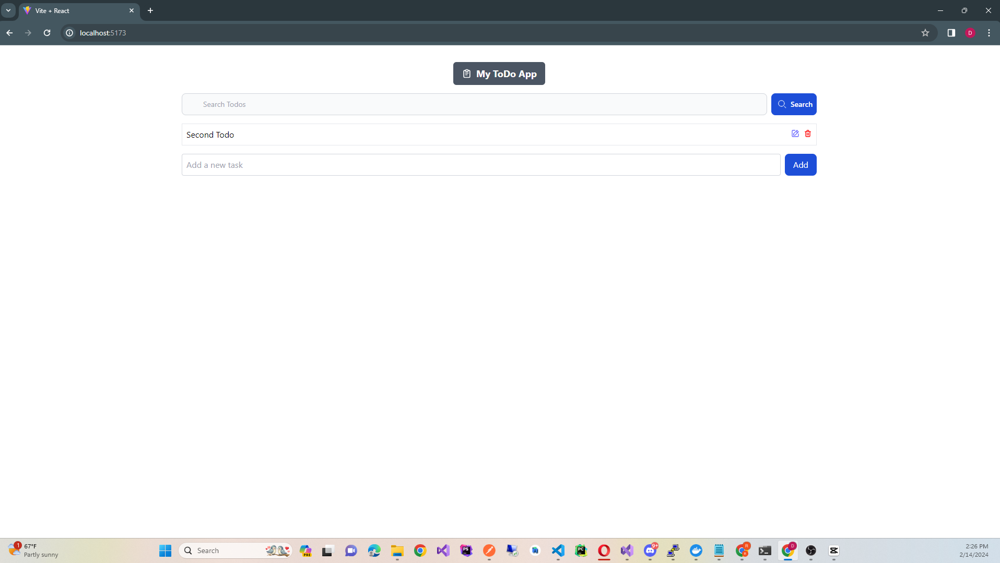

# .NET Core 8 Web API with Repository Pattern

This project is a .NET Core 8 Web API application using the repository pattern, integrated with a PostgreSQL database managed by Docker. It features CRUD operations for managing Todo items with support for pagination and filtering.

## Prerequisites

Before starting, ensure you have the following installed:

- [.NET 8 SDK](https://dotnet.microsoft.com/en-us/download/dotnet/8.0)
- [Docker](https://www.docker.com/get-started)
- [Entity Framework Core CLI](https://docs.microsoft.com/en-us/ef/core/cli/dotnet)

## Getting Started

## Projects in Image

### 1. Clone the Repository

Clone the repository to your local machine

### 2. Setting Up Docker for PostgreSQL

docker-compose up -d

### 3. Running Migrations

dotnet ef database update

### 4. Running the Application

dotnet run
